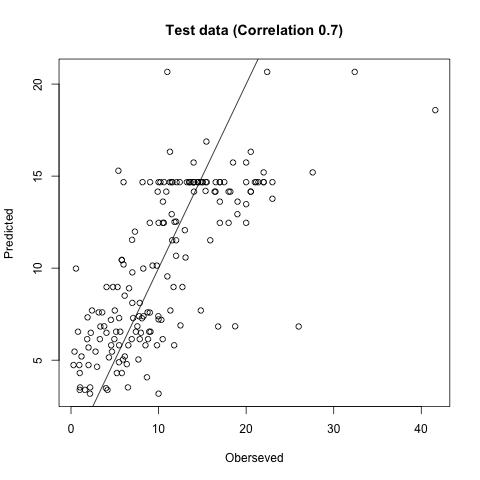

```{r setup, include=FALSE}
knitr::opts_chunk$set(echo = TRUE)
```

```{r message=FALSE, warning=FALSE, include=FALSE, paged.print=FALSE}
library(tinytex)
```

## 1. introduction

Nowadays, students in university tend to consider data science as their majors. Because of the high salary, the jobs of data scientist and data engineer become much more hot when new graduates are finding jobs. We are interested in finding the potential factors making impacts on the salary of data scientist and data engineer and making the model to learn how important those factors are to make some effects on the salary of those jobs. Therefore, we choose data of the salary of data scientists and data engineers from Kaggle. It also includes some potential factors which may have some impacts on the salary. We also can discover the influence of the Covid-19 with the working year. We would build the regression model of some potential factors on the salary amount, find the significance of those potential factors, and interpret the factors.

## 2. Data description

In our data, the sample size is 607. We include some potential factors to discover such as working year (before Covid-19 period (2019-2020) and after Covid-19 period (2022) , experience level in job during the year (entry level, junior or mid level, intermediate senior level, expert executive level, and director), the percentage of working time remotely (0-20%, 20%-80%, 80%-100%), company main office location, and company size (0-50, 50-250, larger than 250 people). Data could be downloaded from "<https://www.kaggle.com/datasets/ruchi798/data-science-job-salaries?resource=download&select=ds_salaries.csv>".

## 3. Method

**Linear regression model and Anova**

We use BOX-COX transformation to make the linear transformation for salary in US dollars in order to fit the model better. We build a linear regression model between salary in US dollars in square root transformation and other potential variables. By using the power of linear regression model, we use anova table for the linear regression table to find the significance of all of the effects among all categorical levels. We can know which variables can have statistically significant effects with the salary in US dollars for data scientists.


**Visualize the effect**

To visualize the significance of the independent variable effects, we use boxplot to show the distribution of salary in US dollars between different groups for each effect. We may better understand the relationship between salary of data scientists and other effects. People could use those effects as the reference to choose their expected salary when finding jobs.

**Predict the salary**

To help students know the expected salary as the reference to find the jobs, we test the predictive power of the model by dividing 70% samples as the training data and 30% samples as the testing data. We fit the model with training data and predict the data. We compare the correlation and mean square error between observed salary and predicted salary in the testing data.

## 4. Result

**Linear regression estimate (Figure 1)**

From the coefficient estimate of the linear regression model, we can find that the expected salary in 2022 is larger than before 2022; expected salary of expert is the largest among all experience level; the expected salary of remote ratio 100% is the largest; if company is in US, the expected salary is larger than not in US; large size company can have the largest expected salary comapred with small size and midium size.


**ANOVA table (Figure 2)**

The anova table shows that all of the five effects among all categorical levels are statistically significant since the p values are all smaller than 0.05 threshold.


**Boxplot for five effects (Figure 3 and 4)**

We can clearly visualize the estimated coefficient for each effect in the observed salary in US dollars. It is consistent with the results table in the fitted model.


**Predict the salary (Figure 5)** The mean absolute error between testing observed salary and testing predicted salary is 34K and the correlation is 0.7. The high correlation shows that the predicted salary is useful for predicting the expected salary when providing the variables. The mean error shows that the difference in the expected salary and the actual salary is 34K.



## 5. RShiny

We also make a website tool based on R to filter the data and table based on different conditions of the five variables. We can look up the tables as well as the boxplot for those tables. It is a great tool for us to know the distribution of the salary for the existing data.

## 6. Discussion

Our report proposes to use a linear regression model to fit the model between salary in US dollars for data scientists and five significant variables including working year, experience level in job during the year, the percentage of working time remotely, company main office location, and company size. The ANOVA table shows that all of the five variables among all categorical levels are statistically significant and could be used to predict the salary and match the salary when people are looking for data scientists jobs. The mean absolute error when we predict the test data is 34K which could be used as the reference to set their own expected salary based on the conditions for the company. In this report, even though the sample size is small and the result is not accurate, it could be a great way to set up a reference for graduates to know the expected salary for the company.
